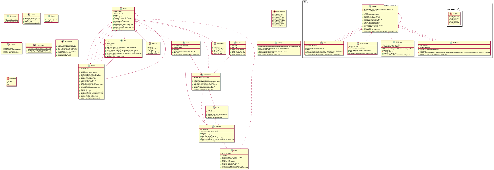

# AdaShip

# NOTE: DEBUG MODE CAN BE ENABLED/DISABLED IN THE ADASHIP_CONFIG.INI FILE
Repl.IT Project URL: https://replit.com/@alexr03/AdaShip

## Challenge Outline
This is an assignment provided by Ada. Its purpose is to provide a console-style based game of "battleships".

The code provided here is the code for the battleships game. This should be done at least to a "Merit" standard but also contains some
criteria for "Distinction" level.

This assignment is part of the "Advanced Programming" module.

The code in this project follows the standards of OOP programming using polymorphism, inheritance, reusable and efficient code.

### UML Diagram
Below the image will show you the UML diagram of this project.

### Tasks/Features
- [x] Take settings of the game state from a ini file.
  - [x] Use sections
  - [x] Use proper .ini file format
  - [x] Board Configuration
    - [x] Size X
    - [x] Size Y
  - [x] Ship Configurations
    - [x] ShipName=Length
  - [x] Settings
    - [x] Debugging Model
    - [x] Show Ships on Grid
    - [x] Show Bombs on Grid
- [x] Main Menu
  - [x] Player vs Computer
  - [x] Player vs Player
  - [x] Player vs Computer (Salvo mode)
  - [x] Player vs Player (Salvo mode)
  - [x] Player vs Computer (Bombs)
  - [x] Player vs Player (Bombs)
  - [x] Quit
- [x] Ship Placements
  - [x] Automatic
  - [x] Manual
  - [x] Automatic (per ship)
- [x] Grids
  - [x] See my board
  - [x] See opponents board
  - [x] Proper table system
    - [x] Rows
    - [x] Columns
  - [x] Support any size specified in .ini file
- [x] Validation
  - [x] Validate user input
  - [x] Validate AI input
  - [x] Validate .ini input
- [x] AI
  - [x] Targets on its own
  - [x] Fires randomly
  - [x] Clear hit/miss by showing color and icon on the opponents board.
  
### Refactoring
- [x] Remove duplicates
- [x] Make custom player objects inherit from one player
- [x] Use polymorphism to override Player::takeTurn();
- [x] Remove code "smells"
  - [x] Efficient code
  - [x] Easy to read code
- [x] Well commented code.

## Development
### Adoption/Use of good standards
The most important part about this program is to build code that is "of to a good standard". This is done by picking up good
standard industry practices for example:
 - Comments/Documentation: 
   Properly commented code will help a tonn when coming back to a project helping the developer know whats what.
 - Readable but efficient code: 
   Build methods that are easy to read and understand but also does the job efficiently.
 - No hard coding: 
   We want to make our program scale, so we try to avoid hard coding variables as much as possible (Like the board size)
  so we can modify these via a .ini file.
 - Helper Methods: Repeatable tasks should be done via helper methods to keep code succinct and concise.

### Phase 1 Development
I decided to go with an agile way of working on this application. I would build a few features, test and deploy them. And when this
cycle comes to an end I go back over the features I implemented and refactor them and make any changes I feel should be made to make
the program easier to use, or more efficient to use.

The first iteration of the development cycle I started off with the basics. User input, menu, etc. No core game mechanics were implemented yet.
Once the first iteration was over I then went back, and refactored the code. Some code turned into helper methods like user input. Some code
was refactored into their own classes like the Menu. All-in-all this made the code much easier to write later on in the development process.

### Phase n Development

Over the next iterations of the development phase, I implemented core game mechanics like the grid system, coordinate system.
Even though this was implemented, in subsequent phases of the development cycle, many features in this game mechanic systems were changed. 
This was due to many things that were being added/changed like bombs in the game where it needed its own specific gameplay logic.

For objects like map entities, I ended up creating a base class called "MapEntity" this contains a coordinate vector, this allows for forcing
every map entity to have a coordinate. With this data I can check for things like overlapping with other entities by just checking the
base MapEntity object on the bomb or ship etc.

### Quality Control
When I was implementing features, I would implement small snippets at a time and run through to test them. 
I would repeat this process over and over again until the feature was complete. If during my testing of a feature there was something
that broke. I would run the code through a debugger and figure out why its not working in the first place rather than just throwing in 
a few fixes that I felt "might be the issue".

When I was reaching "end-game" features, during testing I would run through the program from start to finish tracing down bugs that I may
of missed during the agile development phases. If bugs arose I would go ahead and fix them and when a fix is implemented I would ensure that
the fix did not break anything else further down the code. Git really became helpful for this for rolling back code that was changed into
a broken state.

### Key Design Challenges/Innovations
One of the most challenging part of the program is the Player. Specifically changing the player's logic when its Ai based or controlled
by a real user.
The way I was over to overcome this was to make use of polymorphism. I had a base object called Player. This object didn't do anything
special, it was more of a criteria that all derived classes should inherit and override.
The Player base object contained everything that is needed for gameplay to commence, like the game board, access to the current game,
access to the ships the player has control of on their board etc. But then it also has virtual methods like takeTurn(). The point of this
method isn't for Player to implement the logic. But for derived classes to. E.G.

 - `RealPlayer::takeTurn()` This will override the `Player::takeTurn()` method and take user input. With this user input we can
   get the RealPlayer to input coordinates for where they would like to shoot and then control the player using its properties from the
   base class to shoot into a specific location into the opponent, or by checking if there is a bomb present on that coordinate, or even
   if that coordinate is valid at all.
   
 - `AiPlayer::takeTurn()` This will override the `Player::takeTurn()` method but instead of taking user input it will instead use a simple
   algorithm to select a row and column on the grid. It will then use these values to do the other same logic to shoot into a location.
   This is sort of like emulating what the user is doing. 
   
## Evaluation
### Analysis with Embedded Examples Of Key Code Refactoring.
#### `Grid::IsEntityOverlapping(MapEntity &entity)`
This method was created after many iterations of a previous method that was called `Grid::IsShipOverlapping(Ship &ship)` this method
used to only check collisions of a ship with other ships. As I was progressing and decided to go for distinction level, I needed to implement
overlap checking with other entities like bombs. To do this I created a new method called `IsEntityOverlapping`, you provide this method with any object
that inherits "MapEntity" this works because MapEntity contains the coordinates of the entity which is what this method is using. This way
I can check all MapEntities in the board to check for overlapping all with one line of code that returns true/false.

#### `MapEntity` Object
This object contains the essentials for an entity to be shown on the grid. Specifically the coordinates grid.
Before this object was implemented every entity used to contain their own vector of coordinates that had to be defined in every object
that was considered to be a map entity. This was very bad as, as in the above method I would need to remake it for every type and run against every
other entity. This would be cumbersome, so inheriting from MapEntity and allowing me to pass in any object to the method above makes this super
easy to use.

### Implementation and Effective Use of Advanced Programming
#### Forward Declaration of Classes (Circular Dependencies)
I had to make use for forward declarations in some classes for my code to compile. This made it easy to reference objects that referenced the current object.
E.G. `Player` has a property for `PlayerBoard` but we also want to access this backwards, we want to access `Player` from `PlayerBoard`. 
We cannot do this by just referencing it and setting it via a setter or the constructor. Doing this will cause a circular reference dependency
stopping the program from compiling. To fix this I had forward declared the `Player` class in the `PlayerBoard`. And then in the `PlayerBoard.cpp` file
I use the `#include` definer, to include the real `PlayerBoard` this will allow me to use the `PlayerBoard` methods/properties/fields, etc.
I can then also use a setter or even the constructor to set this property from the player by simply doing something like `player.SetPlayerBoard(this)`.

### Features Showcase
 - Color Console
    - Red for hit ship
    - Yellow for missed ship
 - Bombs
    - Option for a game with bombs
    - Symbol for bombs on grid
 - Icons
    - Icon for bombs
    - Icon for ship (ID)
    - Icon for missed missile position
    - Icon for hit missile position
 - GameModes
    - Player v Computer
    - Player v Player
    - Computer v Computer
 - Customizable
    - Highly customizable .ini file
    - Unlimited Ships (Works by giving the ships a unique ID, based on their position in the .ini file)
    - Unlimited Grid Size (Providing your screen is wide enough OR your terminal supports side-to-side scrolling)
    - Customizable ship lengths
    - Ability to see ships on the board via .ini file
    - Ability to see bombs on the board via .ini file
    
### Improved Targeting Algorithm
N/A (See below)

### Reflective Review
#### Targeting Algorithm
Due to some time restraints I could not implement a improved targeting algorithm in time for the deadline. However I do have an idea on
how I could implement something like this. Implementation of this "mode" would be easy to do, I can create another menu option to set the mode
of the AI. If this mode was set to e.g. "Advanced" I would instead create a new instance of a new Player Object called "AdvancedAiPlayer"
which would inherit "AiPlayer" so it has its custom functions to do specific AI related stuff from the normal AI. 

#### Validation
There are a few places where I could have improved user input validation. Some places will cause the program to stop functioning as it tries to convert
like a empty string to an integer which uses `std::stoi()`, with an empty string this will throw an exception.

#### Exception Handling
There are a few places in my code where exceptions could be thrown by the system, e.g. from an invalid input, to accessing a vector using
an out of range index. I could wrap these in try-catch blocks and if they are thrown I can show a user-friendly message. 

#### Commenting
I could have commented more of my code in-line. I mainly focused on documentation the code with the `///` comments above the method declaration
or class declaration in the header files `(.h)`. This way in a reputable IDE, it will pick up on this documentation and will show the docs right in
the IDE. 