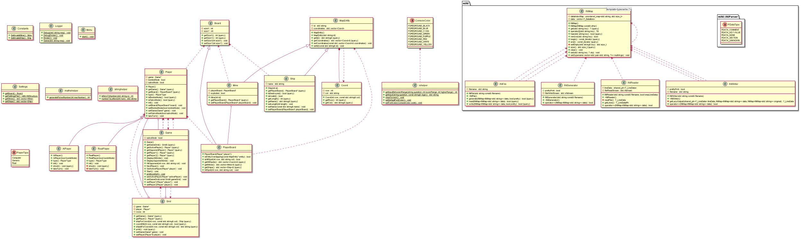

# AdaShip

## Challenge Outline
This is an assignment provided by Ada. Its purpose is to provide a console-style based game of "battleships".

The code provided here is the code for the battleships game. This should be done at least to a "Merit" standard. 

This assignment is part of the "Advanced Programming" module.

The code in this project follows the standards of OOP programming using polymorphism, inheritance, reusable and efficient code.

### UML Diagram
Below the image will show you the UML diagram of this project.

### Tasks/Features
- [x] Take settings of the game state from a ini file.
  - [x] Use sections
  - [x] Use proper .ini file format
  - [x] Board Configuration
    - [x] Size X
    - [x] Size Y
  - [x] Ship Configurations
    - [x] ShipName=Length
- [x] Main Menu
  - [x] Player vs Computer
  - [x] Quit
- [x] Ship Placements
  - [x] Automatic
  - [x] Manual
  - [x] Automatic (per ship)
- [x] Grids
  - [x] See my board
  - [x] See opponents board
  - [x] Proper table system
    - [x] Rows
    - [x] Columns
  - [x] Support any size specified in .ini file
- [x] Validation
  - [x] Validate user input
  - [x] Validate AI input
  - [x] Validate .ini input
- [x] AI
  - [x] Targets on its own
  - [x] Fires randomly
  - [x] Clear hit/miss by showing color and icon on the opponents board.
  
### Refactoring
- [x] Remove duplicates
- [x] Make custom player objects inherit from one player
- [x] Use polymorphism to override Player::takeTurn();
- [x] Remove code "smells"
  - [x] Efficient code
  - [x] Easy to read code
- [x] Well commented code.